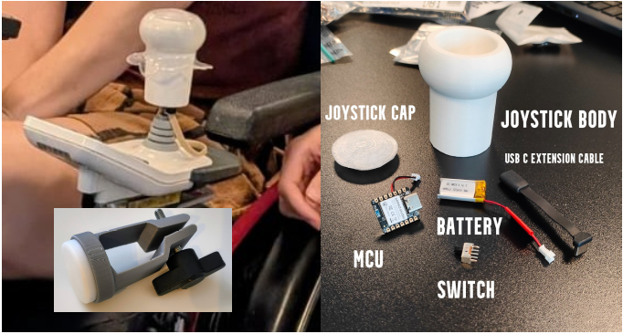

# Adapted Wireless Wheely Joystick for Gaming
(Fork of Project Custom-Game-Station of ASSIST HEIDI course SS22026)

This is a prototype of a wheelchair joystick adapted as a wireless (Bluetooth LE) gaming controller.
An additional wireless button ([Puck-js](https://www.puck-js.com/)) changes the operation mode (<kbd>w</kbd><kbd>a</kbd><kbd>s</kbd><kbd>d</kbd>-keys or mouse movement).
By the default the wasd keys are sent depending on the tilt level of the joystick. When the button is pressed and held, mouse movements are sent accordingly.

## Demo Video

The [demonstration video](./Photos/Wireless-Wheely-Joystick-with-Wireless-Knee-Button-for-Gaming1_subtitled.m4v) shows the controller in action.

## Setup

 Check the [User Manual](./User%20Manual/README.md) for setup instructions and operation modes.
 If you are interested in technical details check [TechnicalDocumentation.pdf](./TechnicalDocumentation.pdf)
